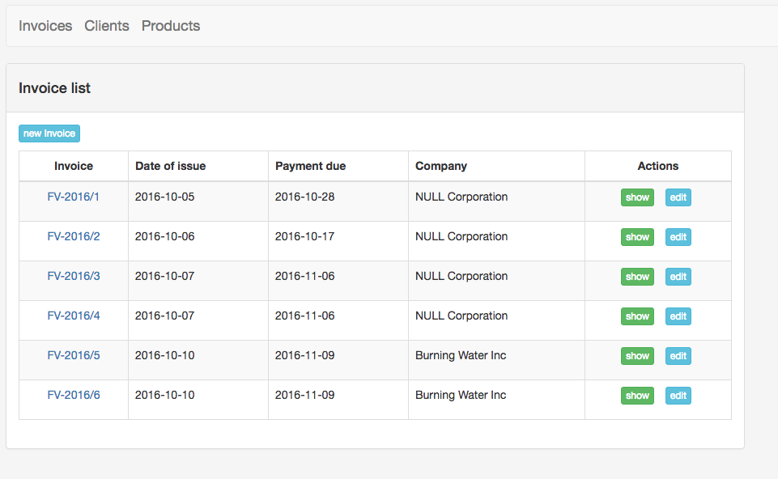
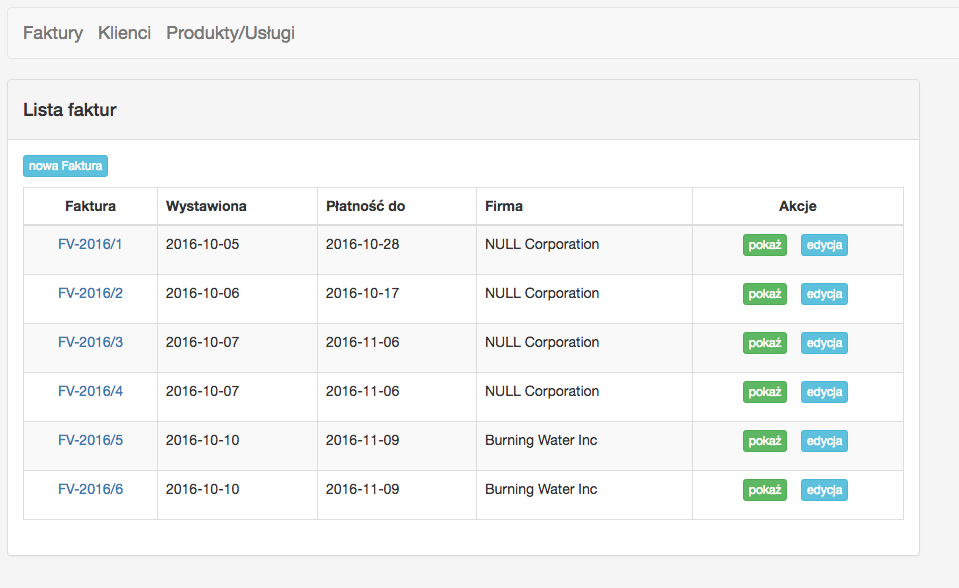
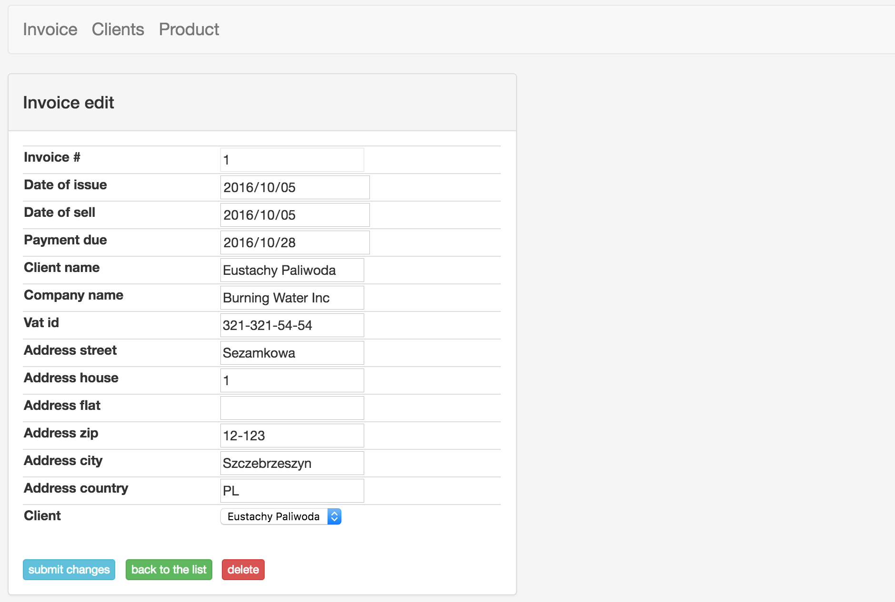
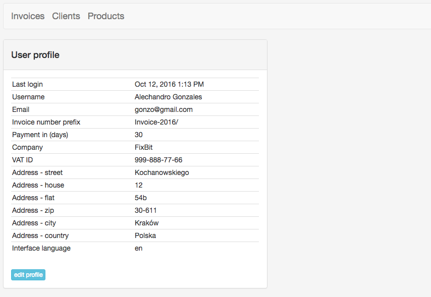
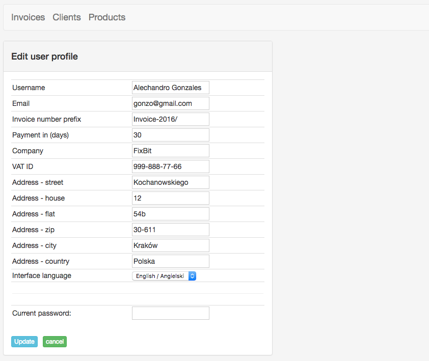

# Invoice

### (some functionality - work in progress)

### **Symfony** application at <a target="_blank" href="http://coderslab.pl">CodersLab</a> **BACK-END Developer** training

### Components used
* Symfony 2.8
* FOSUserBundle
* JMSTranslationBundle

### Working application
 * http://invoice-cl.herokuapp.com
 * login: jdoe@gmail.com
 * password: john.doe

### Working application screen shots

* Invoice list

* Invoice list PL (i18n translation)

* Invoice edit

* User profile show

* User profile edit

